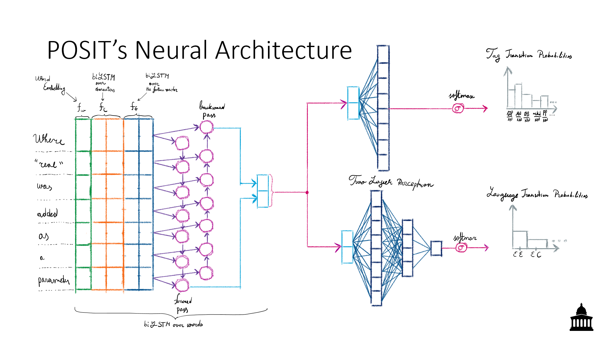

# POSIT

Software developers use a mix of source code and natural language text to communicate with each other: 
Stack Overflow and Developer mailing lists abound with this mixed text. 
Tagging this mixed text is essential for making progress on two seminal software engineering problems — traceability, and reuse via precise extraction of code snippets from mixed text. 
In this paper, we borrow code-switching techniques from Natural Language Processing and adapt them to apply to mixed text to solve two problems: language identification and token tagging. 
Our technique, POSIT, simultaneously provides abstract syntax tree tags for source code tokens, part-of-speech tags for natural language words, and predicts the source language of a token in mixed text. 
To realize POSIT, we trained a biLSTM network with a Conditional Random Field output layer using abstract syntax tree tags from the CLANG compiler and part-of-speech tags from the Standard Stanford part-of-speech tagger.
POSIT improves the state-of-the-art on language identification by 10.6% and PoS/AST tagging by 23.7% in accuracy.

Slides are available [here](https://github.com/PPPI/POSIT/blob/master/docs/slides_icse20_posit.pdf).

The pre-recorded video from ICSE2020 is available below:

This work was done under the supervision of [Earl T. Barr](http://earlbarr.com/) and 
in collaboration with [Santanu K. Dash](http://santanu.uk/), and [Christoph Treude](ctreude.ca).

